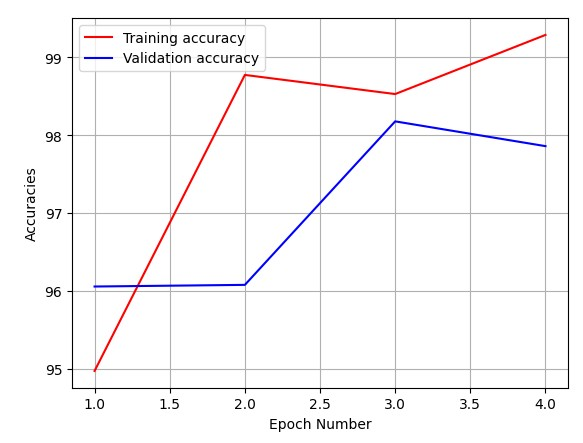
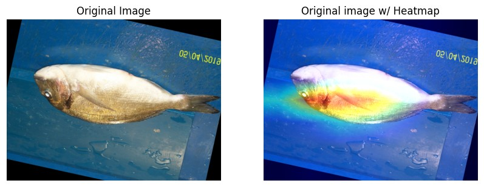
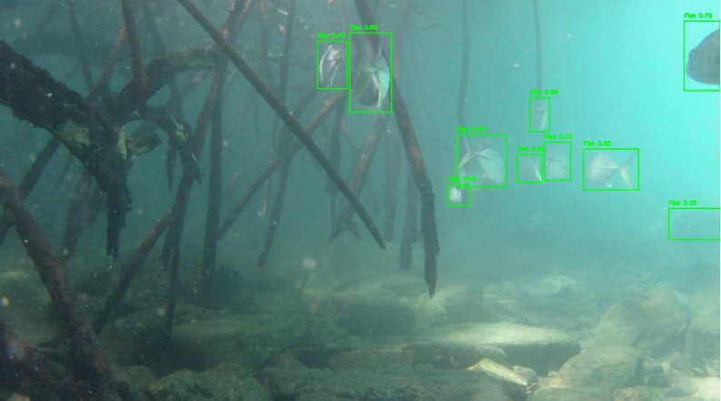

# Fish Species Detection and Tracking Using Deep Learning

This project explores the use of deep learning models to **classify fish species**, **interpret model decision-making**, and **detect and track fish in complex underwater environments**. The system combines image classification, model explainability techniques, and real-time object detection to demonstrate an end-to-end computer vision pipeline for marine applications.

---

## Model Training Performance

The following graph shows the **training and validation accuracy** of the classification model over multiple epochs.

- The model demonstrates rapid learning within the first few epochs  
- Validation accuracy closely tracks training accuracy, indicating good generalization  
- Minimal overfitting is observed as performance stabilizes at high accuracy levels  

---

## Model Interpretability with Heatmaps

To better understand **what visual features the model uses** when classifying fish species, heatmaps were generated and overlaid on the original input images.

- The heatmap highlights regions of the fish that most influenced the model’s prediction  
- Attention is focused on biologically relevant features such as body shape and texture  
- This improves model transparency and helps validate that predictions are based on meaningful visual cues rather than background noise  

---

## Fish Detection and Tracking Using YOLO

For real-world applicability, YOLO was used to detect and track multiple fish within underwater scenes.

- Bounding boxes identify individual fish in challenging underwater conditions  
- The model successfully detects multiple fish simultaneously  
- This approach enables downstream applications such as population monitoring and behavioral analysis  

---

## Key Technologies Used

- Convolutional Neural Networks (CNNs) for image classification  
- Heatmap-based explainability techniques for model interpretation  
- YOLO for real-time object detection and tracking  
- Python, PyTorch, and OpenCV for model development and evaluation  

---

## Potential Applications

- Automated fish species identification  
- Marine population monitoring  
- Environmental impact assessment  
- Fisheries research and conservation efforts  
